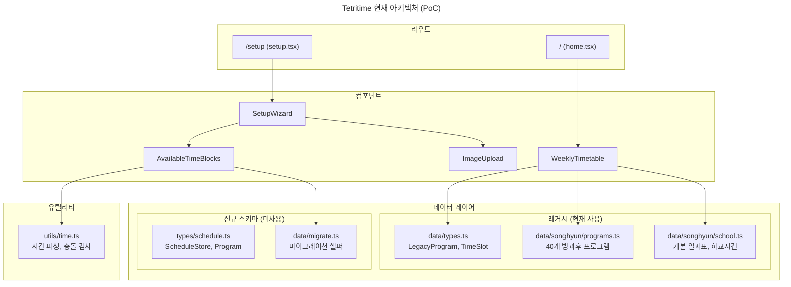
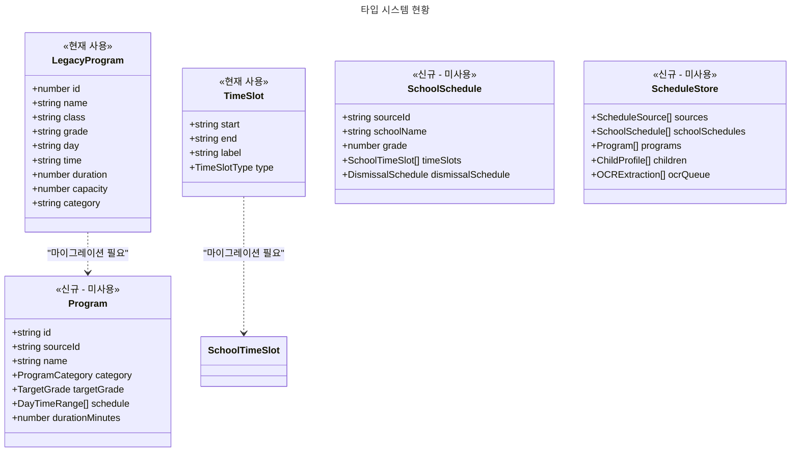
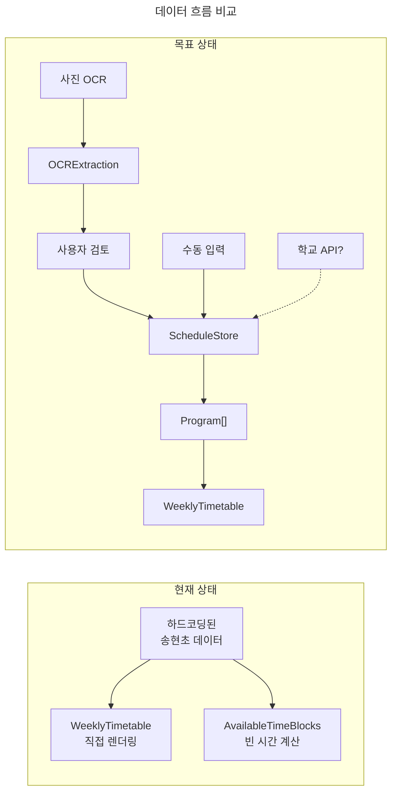
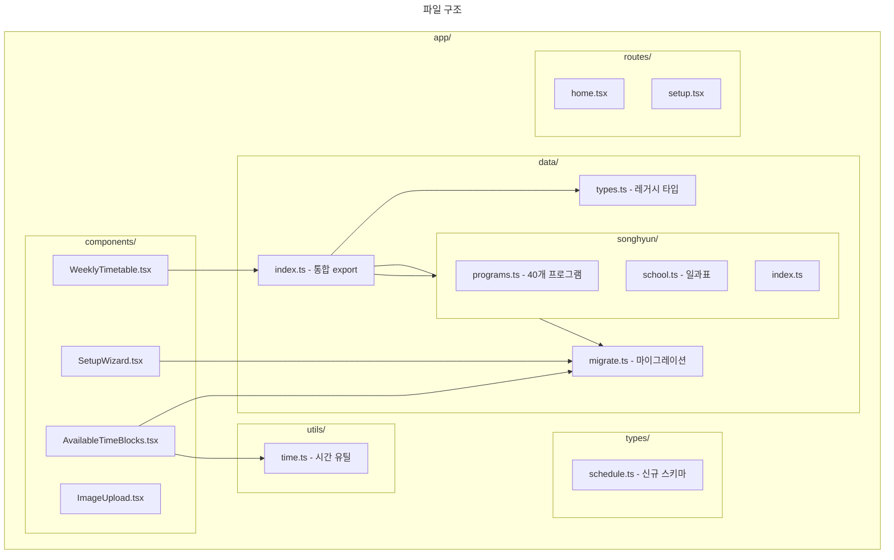

# Tetritime 아키텍처 문서

> 현재 상태 파악 및 개선 방향 정리

## 전체 구조

## 타입 시스템 현황 (이중 구조 문제)

## 데이터 흐름 (현재 vs 목표)

## 파일 구조

## 현재 상태 요약

| 구분 | 상태 | 설명 |
|------|------|------|
| **레거시 타입** | 사용 중 | `LegacyProgram`, `TimeSlot` - UI 렌더링에 직접 사용 |
| **신규 스키마** | 정의만 됨 | `types/schedule.ts` - OCR, 다중소스 지원용 설계 완료 |
| **마이그레이션** | 헬퍼만 존재 | `migrate.ts` - 변환 함수 있으나 미적용 |
| **데이터 저장** | 없음 | 모든 데이터가 하드코딩, 상태 관리 없음 |
| **OCR 연동** | UI만 존재 | `ImageUpload` 있으나 실제 처리 없음 |

## 해결해야 할 문제

### 1. 이중 타입 시스템
- Legacy ↔ New Schema 공존
- 컴포넌트마다 다른 타입 사용

### 2. 상태 관리 부재
- 선택한 프로그램이 새로고침 시 사라짐
- localStorage 또는 DB 연동 필요

### 3. OCR 미연동
- 사진 업로드 후 처리 로직 없음
- Cloudflare AI 또는 외부 API 연동 필요

### 4. 하드코딩 데이터
- 다른 학교 지원 불가
- 동적 데이터 로딩 필요

## 개선 우선순위

```mermaid
---
title: 개선 로드맵
---
gantt
    title 개선 작업 순서
    dateFormat X
    axisFormat %s

    section Phase 1 - 통합
    레거시 타입 신규 스키마로 통합    :a1, 0, 1
    컴포넌트 타입 일원화              :a2, after a1, 1

    section Phase 2 - 저장
    localStorage 상태 저장            :b1, after a2, 1
    선택 프로그램 영속화              :b2, after b1, 1

    section Phase 3 - OCR
    Cloudflare AI 연동               :c1, after b2, 1
    시간표 파싱 로직                  :c2, after c1, 1

    section Phase 4 - 확장
    다중 학교 지원                    :d1, after c2, 1
    다중 자녀 지원                    :d2, after d1, 1
```

## 주요 파일 설명

### 데이터 레이어

| 파일 | 역할 | 상태 |
|------|------|------|
| `data/types.ts` | UI용 레거시 타입 정의 | 사용 중 |
| `data/songhyun/programs.ts` | 송현초 방과후 40개 | 사용 중 |
| `data/songhyun/school.ts` | 송현초 일과표 | 사용 중 |
| `types/schedule.ts` | 확장 스키마 (OCR, 다중소스) | 미사용 |
| `data/migrate.ts` | Legacy→New 변환 | 부분 사용 |
| `utils/time.ts` | 시간 파싱/충돌 검사 | 사용 중 |

### 컴포넌트

| 파일 | 역할 | 사용 타입 |
|------|------|----------|
| `WeeklyTimetable.tsx` | 메인 시간표 렌더링 | Legacy |
| `SetupWizard.tsx` | 셋업 위자드 | Mixed |
| `ImageUpload.tsx` | 사진 업로드 | New Schema |
| `AvailableTimeBlocks.tsx` | 빈 시간 표시 | New Schema |
